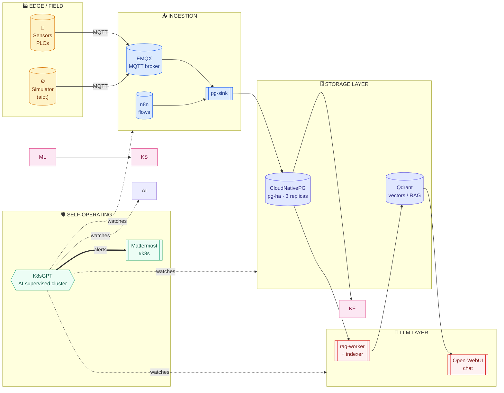
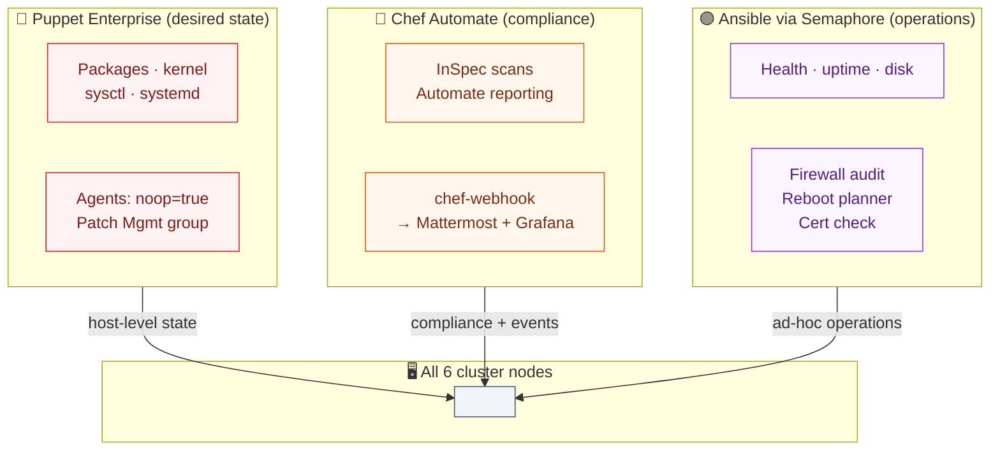
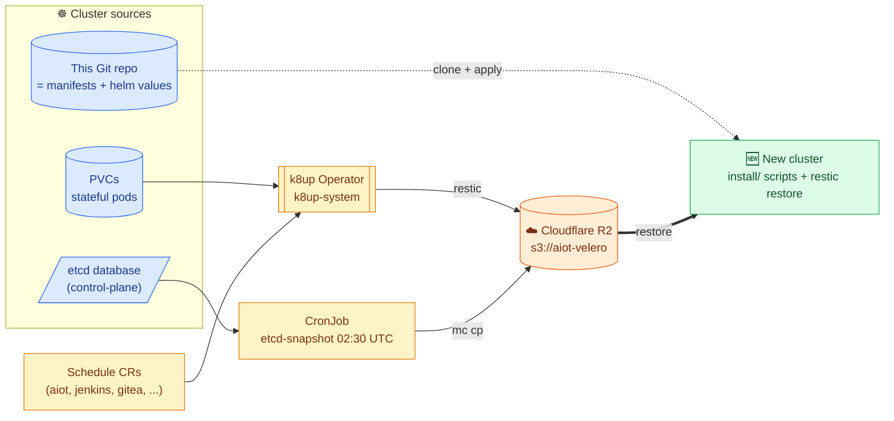

# aiot-platform


-success)


> **Industrial AIoT platform** — an end-to-end system for **collecting, storing, and evaluating industrial sensor data with AI and large language models (LLMs)**. Field devices stream telemetry over MQTT, data is persisted and indexed, and a RAG-enabled LLM interface lets operators **ask questions about production data in natural language**.

The platform was built to answer practical questions from the shop floor — *"Which machine is drifting out of spec?"*, *"What caused yesterday's anomaly?"* — by exposing operational data through an LLM layer (Open-WebUI + Qdrant RAG) grounded in the platform's own MQTT/Postgres history.

## Why this platform exists

Industrial data is useless unless it becomes a **decision**. AIoT is designed around that chain:

1. **Collect** — MQTT ingestion from sensors and PLCs, retained in a time-series–friendly Postgres (CloudNativePG)
2. **Enrich** — digital-twin service aligns raw telemetry with asset metadata; embeddings stored in Qdrant for semantic retrieval
3. **Ask** — operators and engineers interact with the whole system through an LLM chat (Open-WebUI) that uses RAG over platform data and can call the inference service as a tool

Everything runs on a self-hosted, multi-cloud Kubernetes cluster (GCP + OCI), with **Chef Automate**, **Puppet Enterprise**, and **Ansible/Semaphore** keeping hosts and agents in a known state, and **k8up** + an etcd-snapshot CronJob guaranteeing disaster recovery to Cloudflare R2.

## Self-operating cluster — K8sGPT

A unique property of this platform is that the cluster **monitors and reasons about itself**. Namespace **`k8sgpt`** runs:

- **K8sGPT Operator** — continuously analyses every namespace for misconfigurations, failing pods, broken probes, stuck PVCs, CrashLoopBackOff patterns, and RBAC gaps
- **LLM-backed diagnostics** — findings are explained in plain English through an LLM (local or Groq), so an alert reads *"pod X is restarting because liveness probe targets an unreachable port — check service `Y`"* instead of a raw Kubernetes event
- **Anomaly detector** (`k8sgpt-anomaly-detector`) — ML-based trend detection over metrics and logs
- **Mattermost bot** (`k8sgpt-mm-bot`) — posts high-severity findings to the `#k8s` channel in Mattermost; engineers reply in the thread and the bot can run follow-up diagnostics
- **Robusta bridge** (`k8sgpt-robusta-bridge`) — forwards events to Robusta for automated playbook execution (restart, scale, cordon, notify) when the diagnosis matches a known remediation
- **Scheduled reports** — `ai-health-report` and `ai-log-analyzer` CronJobs produce daily summaries of cluster health; `monitoring-watchdog` keeps the pipeline itself alive

The result is an **AI-supervised cluster**: the same LLM technology that answers operator questions about production data also watches the Kubernetes control plane and workloads, flags regressions, and can auto-remediate common issues.


---

## Platform at a glance



---

## Cluster topology


| Node             | Role           | IP (internal)         | OS                | Location              |
| ---------------- | -------------- | --------------------- | ----------------- | --------------------- |
| aiot-master      | control-plane  | 10.132.0.2            | CentOS Stream 9   | GCP `europe-west1-b`  |
| aiot-worker-01   | worker         | 10.132.0.3            | CentOS Stream 9   | GCP `europe-west1-b`  |
| aiot-worker-02   | worker         | 10.132.0.4            | CentOS Stream 9   | GCP `europe-west1-b`  |
| oci-e5-node1     | worker         | 172.16.200.10 (WG)    | Oracle Linux 9.7  | OCI `eu-frankfurt-1`  |
| oci-e5-node2     | worker         | 172.16.200.11 (WG)    | Oracle Linux 9.7  | OCI `eu-frankfurt-1`  |

- **Kubernetes**: v1.32.13 (vanilla kubeadm)
- **CNI**: Cilium 1.16.6 — pod CIDR `10.245.0.0/16`, vxlan overlay (port 8473), kubeProxyReplacement=true, Hubble enabled (migrated from flannel 2026-04-26)
- **Multi-cloud**: OCI nodes join the GCP control plane over a **WireGuard** tunnel; the OCI tenancy is independent of the GCP project and survives GCP outages
- **Public entrypoint**: single IP `35.241.255.137` → **HAProxy** on master → SNI-based TCP proxy to workers' `nginx-ingress` DaemonSet (ports 80/443), with SSH fallback on port 443
- **TLS**: `cert-manager` + Let's Encrypt (HTTP-01), ClusterIssuer `letsencrypt-prod`
- **Storage**: single `local-path` StorageClass (Rancher local-path provisioner) — data is pinned to the node hosting the PVC; **k8up restic backups + etcd snapshots are the only HA/DR path**

---

## The AI data-processing pipeline

The AIoT workflow moves sensor data from the edge into Postgres + Qdrant, and exposes it through a RAG-enabled chat interface.

### 1. Ingestion — `emqx`, `aiot`

- **EMQX** (namespace `emqx`) terminates **MQTT** from field devices (sensor simulators in `aiot/sensor-simulator`)
- **n8n** (namespace `n8n`) orchestrates low-code integration flows (HTTP, webhooks, cron)
- **pg-sink** (in `aiot`) persists raw telemetry into the `aiot` database on `pg-ha`

### 2. Storage — `aiot`, `cnpg-system`

- **CloudNativePG cluster** `pg-ha` (3 replicas in `aiot`) — single source of truth for all tabular/relational data (sensor readings, n8n workflows, Mattermost, SigNoz metadata, …)
- Partitioning and cleanup handled by CronJobs: `pg-partition-mgr`, `pg-sensor-cleanup`, `sensor-data-retention`, `postgres-backup`
- Secondary index/feature store: **Qdrant** (namespace `aiot`) for vector embeddings used by RAG

### 3. RAG / LLM — `aiot`

- **Qdrant** — vector DB for embeddings of sensor metadata, asset descriptions, and historical alerts
- **rag-worker** + **qdrant-indexer** — ingest fresh telemetry summaries and operator notes into Qdrant
- **Open-WebUI** — chat UI on `chat.35.241.255.137.nip.io`, talks to external LLM providers (Groq via `inference-connector`)
- **inference-connector** — thin proxy that exposes a uniform API to the LLM layer
- **api-gateway** — business-level REST/HTTP endpoints on `api.35.241.255.137.nip.io`

---

## Configuration management



### Chef Automate — `chef`, `chef-webhook`

- **Chef Automate** runs **outside Kubernetes**, as a systemd service (`chef-automate.service`) on `aiot-worker-01`, exposed on port `8443` and published under `chef.35.241.255.137.nip.io`
- **Chef Infra Server** drives node convergence across all 6 cluster nodes + test VMs
- Namespace **`chef-webhook`** hosts a webhook receiver that bridges Chef Automate events (compliance runs, client converges, InSpec scans) into the cluster — results land on Mattermost (`mm.35.241.255.137.nip.io`, channel `#k8s`) and into Grafana dashboards
- Compliance scans are exported under `inspec-scans` namespace for long-term retention

### Puppet Enterprise — `chef` ns (`pe.*` ingress), host-level

- **Puppet Enterprise 2023.x** runs on `aiot-worker-01` as a full PE stack (systemd units: `pe-nginx`, `pe-puppetserver`, `pe-postgresql`, `pe-puppetdb`, `pe-orchestration-services`, `pe-ace-server`, `pe-bolt-server`, `pe-host-action-collector`, `pe-console-services`)
- Console at `pe.35.241.255.137.nip.io` (admin)
- **All 6 cluster nodes** are managed agents (`noop=true`), plus demo VMs
- **Patch Management** node group (`aae9e4cd-fed5-4f07-8149-98a699a3b692`) with tasks: `agent_health`, `clean_cache`, `last_boot_time`, `patch_server`, `refresh_fact`
- Puppet and Chef run **side by side**: Puppet handles host-level state (packages, kernel params, systemd units, file drops), Chef handles application-layer state and compliance reporting

### Ansible via Semaphore — `semaphore`

- **Semaphore UI** (namespace `semaphore`) wraps Ansible playbooks with scheduling, history, and audit log
- Playbooks cover **operational tasks** (not drift remediation — that's Puppet/Chef):
  - Health check, uptime, disk usage, gather facts, ping
  - WireGuard check, firewall audit, housekeeping
  - OS check (report), OS update apply, reboot planner, certs check
- Inventory synced from the cluster node list

### Jenkins + Gitea — `jenkins`, `gitea`

- **Gitea** — self-hosted Git (namespace `gitea`), the primary source for CI repos (e.g. `aiot-pipeline-demo`)
- **Jenkins** — multibranch + classic pipelines, builds container images, pushes to the internal registry (namespace `registry`, NodePort 30500), 
- Credentials (Gitea PAT, registry, Docker Hub) stored in Jenkins domain credentials

---

## Backup & disaster recovery — `k8up`, `etcd-backup`

Backup is a **first-class concern** because `local-path` storage has no replication. The platform uses **two independent backup tracks** writing to the same Cloudflare R2 bucket (`s3://aiot-velero`):



### k8up (PVC / file-system backup)

- **Operator**: helm release [`k8up`](cluster-wide/helm-values/k8up-system_k8up.yaml) in namespace `k8up-system` (chart `k8up-4.9.0`).
- **Backend**: `restic` repository in Cloudflare R2 bucket `aiot-velero`, endpoint `https://<acct>.r2.cloudflarestorage.com`. Credentials in `r2-creds` and `k8up-repo` Secrets per namespace.
- **Schedules** (`Schedule.k8up.io` CRs, all named `aiot`):
  - `aiot`, `jenkins`, `gitea`, `backrest`, `semaphore`, `signoz`, `victoriametrics` namespaces
  - **Backup**: daily at 03:10 UTC (`keepJobs: 2`)
  - **Prune**: daily at 04:10 UTC (retention `keepDaily: 2`)
- **Per-pod hooks**: `PreBackupPod` resources let stateful workloads (e.g. CNPG postgres, Jenkins) take application-consistent snapshots before restic runs.
- **Restore**: create a `Restore.k8up.io` CR pointing at a snapshot ID — k8up spawns a restic-restore pod that writes back into the target PVC. See [k8up docs](https://k8up.io) for the CR schema.

### etcd-backup

- Namespace **`etcd-backup`** runs `CronJob/etcd-snapshot` (schedule `30 2 * * *`).
- Init-container `snapshot` (`registry.k8s.io/etcd:3.5.16-0`) runs `etcdctl snapshot save` against the local etcd via `--endpoints=https://127.0.0.1:2379` (host network, control-plane node selector).
- Main container `upload` (`minio/mc:latest`) uploads to `s3://aiot-velero/etcd-snapshots/etcd-<TS>.db` and prunes objects older than 7 days.
- Last verified run: **today** — confirm with `kubectl -n etcd-backup get jobs` and `mc ls r2/aiot-velero/etcd-snapshots/`.

### Restore strategy

| Scenario | Recovery path |
|---|---|
| Single failed PVC | `Restore.k8up.io` CR → restic restore from R2 |
| Lost worker node | Cordon/drain → reprovision VM → `00-vm-prereqs.sh` → `kubeadm join` → workloads reschedule |
| Complete cluster loss | New VMs → `install/` scripts (00→05) → for stateful data: per-namespace `Restore.k8up.io` CRs |
| Control-plane corruption | Reinstall master via `01-init-master.sh` with `--ignore-preflight-errors` then `etcdctl snapshot restore` from R2 |

> **NOTE**: Velero is **not** installed. An older deployment used Velero + a custom UI (`vui.*.nip.io`); both have been retired in favour of k8up.

---

## Public services

All services are published under `*.35.241.255.137.nip.io` with Let's Encrypt certificates.

| Category          | Endpoint (hostname)                            | Namespace         | Notes                                  |
| ----------------- | ---------------------------------------------- | ----------------- | -------------------------------------- |
| AI / chat         | `chat.*`                                       | `aiot`            | Open-WebUI                             |
| RAG API           | `rag.*`, `qdrant.*`                            | `aiot`            |                                        |
| IoT core          | `api.*`, `twin.*`, `ngrok.*`                   | `aiot`            | API gateway, Digital Twin              |
| CI / SCM          | `jenkins.*`, `gitea.*`                         | `jenkins`, `gitea`|                                        |
| Config mgmt       | `pe.*`, `chef.*`, `webhook.*`                  | host / `chef-webhook` | Puppet Enterprise, Chef Automate  |
| Automation UI     | `semaphore.*`                                  | `semaphore`       | Ansible via Semaphore                  |
| DB / data         | `pgadmin.*`, `cloudbeaver.*`, `emqx.*`         | `aiot`, `emqx`    |                                        |
| Observability     | `grafana.*`, `prometheus.*`, `vm.*`, `signoz.*`| `monitoring`, `victoriametrics`, `signoz` |                         |
| Ops               | `headlamp.*`, `mm.*`, `n8n.*`                  | `headlamp`, `mattermost`, `n8n` |                              |

---

## Installing this cluster on fresh VMs

A complete bootstrap workflow lives in [`install/`](install/) — a numbered set
of idempotent shell scripts that take **brand-new Linux VMs** to a fully
running aiot-platform cluster.

```bash
# === On EVERY node (master + workers) ===
sudo bash install/00-vm-prereqs.sh        # containerd, kubeadm, kubelet, helm

# === On master only ===
sudo bash install/01-init-master.sh       # kubeadm init from infra/kubeadm-config.yaml
                                          # → prints `kubeadm join` token; run on workers

# === On master, after all workers joined ===
sudo bash install/02-cilium.sh            # CNI: Cilium 1.16.6 with stored helm values
sudo bash install/03-platform.sh          # cert-manager + ingress-nginx + local-path
sudo bash install/04-helm-charts.sh       # all 14 helm releases (Rancher, ArgoCD, …)
sudo bash install/05-apply-cluster.sh     # CRDs + cluster-scoped + per-NS manifests

# === Optional: restore Secrets + PVC data ===
export AWS_ACCESS_KEY_ID=…  AWS_SECRET_ACCESS_KEY=…  R2_ENDPOINT=https://….r2.cloudflarestorage.com
./install/06-k8up-restore.sh restore <namespace> <pvc> [snapshot]
```

Or simply:

```bash
make prereqs       # 00
make init          # 01
make all           # 02 → 03 → 04 → 05
make restore       # 06 (optional)
make status        # show health
```

Helm release catalogue (chart, version, repo, values file) is declared in
[`install/helm-charts.csv`](install/helm-charts.csv). Cluster topology
(API endpoints, node CIDR, certs SANs) is declared in
[`infra/kubeadm-config.yaml`](infra/kubeadm-config.yaml). Cilium tuning lives
in [`cluster-wide/helm-values/kube-system_cilium.yaml`](cluster-wide/helm-values/kube-system_cilium.yaml).

See [`install/README.md`](install/README.md) for the full guide, recovery
procedures, and what is **not** in the repo (secrets, WireGuard mesh, external
services).

## Repository layout

```
aiot-platform/
├── README.md                ← this file
├── Makefile                 ← `make prereqs|init|cilium|platform|helm|apply|all|status`
├── .gitignore
│
├── install/                 ← FRESH-VM BOOTSTRAP — installs everything below
│   ├── README.md
│   ├── 00-vm-prereqs.sh        (containerd + kubeadm + kubelet + helm)
│   ├── 01-init-master.sh       (kubeadm init from infra/kubeadm-config.yaml)
│   ├── 02-cilium.sh            (Cilium 1.16.6 CNI)
│   ├── 03-platform.sh          (cert-manager + ingress-nginx + local-path SC)
│   ├── 04-helm-charts.sh       (all 14 Helm releases from helm-charts.csv)
│   ├── 05-apply-cluster.sh     (CRDs + cluster-scoped + per-NS manifests)
│   ├── 06-k8up-restore.sh      (Restore.k8up.io CR generator: list / restore)
│   └── helm-charts.csv         (declarative chart catalog)
│
├── infra/                   ← host-level / platform files
│   ├── kubeadm-config.yaml     (cluster-init source of truth)
│   ├── kubelet-config.yaml
│   ├── kube-apiserver.yaml
│   ├── etcd.yaml
│   ├── cni-cilium.conflist     (Cilium CNI config — replaced flannel 2026-04-26)
│   ├── haproxy/                (HAProxy SNI proxy on master, ports 80/443)
│   ├── registry/               (internal Docker registry config)
│   ├── gcp-instances.yaml
│   └── gcp-firewall-rules.yaml
│
├── cluster-wide/            ← cluster-scoped resources (snapshot)
│   ├── crds.txt                (CRD name list)
│   ├── clusterroles.yaml
│   ├── clusterrolebindings.yaml
│   ├── clusterissuers.yaml
│   ├── ingressclasses.yaml
│   ├── storageclasses.yaml
│   ├── priorityclasses.yaml
│   ├── persistentvolumes.yaml
│   ├── nodes.yaml
│   ├── helm-releases.yaml      (all Helm releases + chart versions)
│   ├── images.txt              (every container image currently used)
│   └── helm-values/            (14 files: <ns>_<release>.yaml — `helm get values`)
│
├── namespaces/              ← 80 namespaces, sanitized snapshot (no secrets)
│   └── <ns>/
│       ├── deployments.yaml
│       ├── statefulsets.yaml
│       ├── daemonsets.yaml
│       ├── cronjobs.yaml
│       ├── jobs.yaml
│       ├── services.yaml
│       ├── ingresses.yaml
│       ├── configmaps.yaml
│       ├── pvcs.yaml
│       ├── pdb.yaml
│       ├── hpa.yaml
│       ├── networkpolicies.yaml
│       ├── serviceaccounts.yaml
│       ├── rbac.yaml                        (Roles + RoleBindings)
│       ├── secrets.sanitized.yaml           (data values redacted)
│       ├── certificates.yaml                (cert-manager)
│       ├── issuers.yaml                     (cert-manager)
│       ├── servicemonitors.yaml             (prometheus-operator)
│       ├── podmonitors.yaml                 (prometheus-operator)
│       └── istio-*.yaml                     (gateways, virtualservices,
│                                             destinationrules, authorizationpolicies,
│                                             peerauthentications, telemetries,
│                                             envoyfilters)
│
├── manifests/               ← parallel raw snapshot written by nightly cron
│   ├── _cluster/               (namespaces.yaml, clusterroles, CRDs index, ...)
│   ├── _crds/                  (144 individual CRD YAMLs)
│   └── <ns>/                   (raw kubectl get -oyaml dumps incl. secrets)
│                               NOTE: not sanitized — used internally only,
│                                     not for re-installation onto a new cluster.
│
├── cloudflare/              ← Cloudflare DNS snapshot (zone records)
│   └── dns/
│
├── cluster/                 ← misc cluster-level dumps
│   └── versions.md             (kubectl/cilium/helm versions, node list)
│
└── inventory/               ← Ansible / Semaphore inventory snapshot
    └── semaphore-configmaps.yaml
```

> Use **`namespaces/`** + **`cluster-wide/`** + **`infra/`** + **`install/`** for
> bootstrapping a clean cluster. **`manifests/`** is a private nightly snapshot
> that may contain unredacted Secrets — do **not** apply it on a foreign
> cluster.
