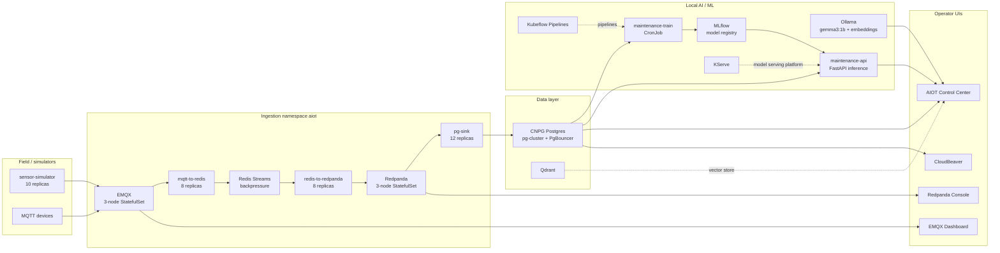
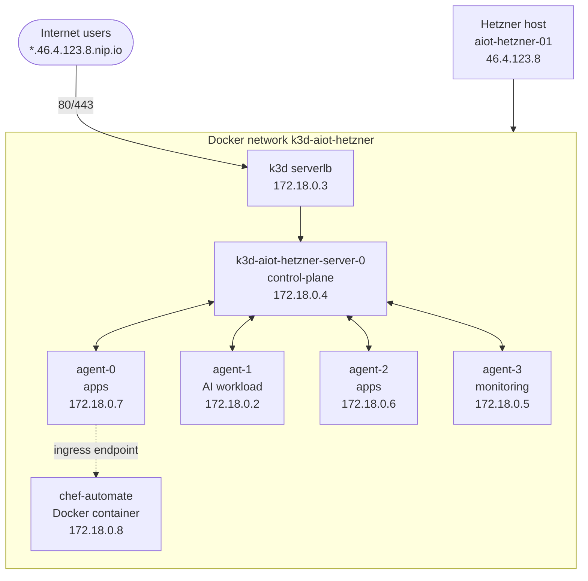
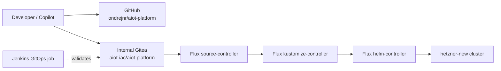

# aiot-platform


> **Industrial AIoT platform** running on the active `hetzner-new` cluster: a self-hosted stack for MQTT sensor ingestion, streaming, storage, local ML training, local LLM-assisted operations and platform observability. The current runtime avoids external LLM APIs for the Control Center and uses local Ollama models.

The repository is mirrored to GitHub and the internal Gitea instance. Flux reads the internal Gitea repository and reconciles the cluster from `flux/clusters/hetzner-new`.

---

## Current status

| Area | Current value |
|---|---|
| Active cluster | `hetzner-new` on Hetzner host `46.4.123.8` |
| Kubernetes | k3d/k3s `v1.31.5+k3s1` |
| Nodes | `1` k3d server + `4` k3d agents |
| Public DNS | `*.46.4.123.8.nip.io` |
| GitOps | Flux `v2.6.4`, internal Gitea source |
| Primary repo path on host | `/root/aiot-platform` |
| Active GitOps path | `flux/clusters/hetzner-new` |
| Active app charts | `apps/*` |
| Storage classes | `nfs` for shared app storage, `local-path` for node-local workloads |
| SSO | Authentik + selected forward-auth/OIDC integrations |
| Local AI | Ollama `gemma3:1b` chat fallback + `nomic-embed-text` embeddings |
| ML | MLflow `2.21.3`, Kubeflow Pipelines `2.15.0`, KServe `v0.15.2` |

> Historical exports under `namespaces/`, `cluster-wide/` and `manifests/` are legacy references from older clusters. They are not the active source of truth for `hetzner-new`.

---

## Why this platform exists

Industrial telemetry becomes useful only when it becomes a decision. AIOT is built around this path:

1. **Collect** — sensors and simulators publish MQTT telemetry into EMQX.
2. **Buffer** — Redis Streams absorb bursts and provide backpressure.
3. **Stream** — Redpanda keeps a Kafka-compatible event log.
4. **Persist** — Postgres stores the operational history.
5. **Learn** — scheduled training produces MLflow maintenance models.
6. **Predict** — the inference API serves latest predictive-maintenance labels.
7. **Operate** — Control Center shows current risk and answers operational questions locally.

---

## Platform architecture


```mermaid
flowchart LR
    subgraph FIELD["Field / simulators"]
        SIM["sensor-simulator\n10 replicas"]
        DEV["MQTT devices"]
    end

    subgraph INGEST["Ingestion namespace aiot"]
        EMQX["EMQX\n3-node StatefulSet"]
        M2R["mqtt-to-redis\n8 replicas"]
        REDIS["Redis Streams\nbackpressure"]
        R2R["redis-to-redpanda\n8 replicas"]
        RP["Redpanda\n3-node StatefulSet"]
        PGS["pg-sink\n12 replicas"]
    end

    subgraph DATA["Data layer"]
        PG["CNPG Postgres\npg-cluster + PgBouncer"]
        QD["Qdrant"]
    end

    subgraph AI["Local AI / ML"]
        OLLAMA["Ollama\ngemma3:1b + embeddings"]
        MLFLOW["MLflow\nmodel registry"]
        KFP["Kubeflow Pipelines"]
        KS["KServe"]
        TRAIN["maintenance-train\nCronJob"]
        API["maintenance-api\nFastAPI inference"]
    end

    subgraph UI["Operator UIs"]
        CC["AIOT Control Center"]
        CB["CloudBeaver"]
        RPC["Redpanda Console"]
        EMQXD["EMQX Dashboard"]
    end

    DEV --> EMQX
    SIM --> EMQX
    EMQX --> M2R --> REDIS --> R2R --> RP --> PGS --> PG
    PG --> TRAIN --> MLFLOW --> API
    PG --> API
    PG --> CC
    API --> CC
    OLLAMA --> CC
    PG --> CB
    RP --> RPC
    EMQX --> EMQXD
    QD -.vector store.-> CC
    KFP -.pipelines.-> TRAIN
    KS -.model serving platform.-> API
```

---

## Cluster topology


```mermaid
flowchart TB
    USER(["Internet users\n*.46.4.123.8.nip.io"])
    HOST["Hetzner host\naiot-hetzner-01\n46.4.123.8"]

    subgraph DOCKER["Docker network k3d-aiot-hetzner"]
        LB["k3d serverlb\n172.18.0.3"]
        S0["k3d-aiot-hetzner-server-0\ncontrol-plane\n172.18.0.4"]
        A0["agent-0\napps\n172.18.0.7"]
        A1["agent-1\nAI workload\n172.18.0.2"]
        A2["agent-2\napps\n172.18.0.6"]
        A3["agent-3\nmonitoring\n172.18.0.5"]
        CHEF["chef-automate\nDocker container\n172.18.0.8"]
    end

    USER -->|80/443| LB
    HOST --> DOCKER
    LB --> S0
    S0 <--> A0
    S0 <--> A1
    S0 <--> A2
    S0 <--> A3
    A0 -.ingress endpoint.-> CHEF
```

| Node | Role labels | Internal IP | Runtime |
|---|---|---|---|
| `k3d-aiot-hetzner-server-0` | control-plane | `172.18.0.4` | k3s/containerd |
| `k3d-aiot-hetzner-agent-0` | `role=apps` | `172.18.0.7` | k3s/containerd |
| `k3d-aiot-hetzner-agent-1` | `role=ai`, `workload=ai` | `172.18.0.2` | k3s/containerd |
| `k3d-aiot-hetzner-agent-2` | `role=apps` | `172.18.0.6` | k3s/containerd |
| `k3d-aiot-hetzner-agent-3` | `role=monitoring` | `172.18.0.5` | k3s/containerd |

---

## Services currently represented by this repo

### GitOps-managed services

These are reconciled by Flux from `apps/*` and `flux/clusters/hetzner-new/apps/*.yaml`.

| Category | Namespace / release | What runs there |
|---|---|---|
| Ingress/TLS | `ingress-nginx`, `cert-manager` | public ingress controller, Let's Encrypt ClusterIssuer |
| GitOps | `flux-system` | Flux source, kustomize, helm and notification controllers |
| GitOps UI | `flux-ui/weave-gitops` | Flux web UI |
| Source control | `gitea/gitea` | internal Git source used by Flux and Jenkins |
| CI/CD | `jenkins/jenkins` | GitOps validation and Flux reconcile pipeline |
| AIOT pipeline | `aiot/aiot-pipeline` | EMQX, Redis, Redpanda, bridges, pg-sink, sensor simulator, Redpanda Console |
| AIOT workbench | `aiot/cloudbeaver` | browser DB client for Postgres |
| AIOT vector DB | `qdrant/qdrant` | vector database for AI/semantic workloads |
| AI/ML platform | `aiot-ml/aiot-ml-platform` | Ollama, MLflow, Control Center, maintenance API, training CronJob, namespaces and ingresses |
| Local AI | `local-ai/ollama` | local Ollama runtime and model PVC |
| ML registry | `mlflow/mlflow` | MLflow tracking server and artifact serving |
| ML pipelines | Flux Kustomizations `kubeflow-pipelines*` | Kubeflow Pipelines UI/API stack |
| Model serving platform | Flux Kustomization `kserve` | KServe controller with localmodel controller disabled |
| Postgres operator | `cnpg-system/cnpg` | CloudNativePG operator |
| Postgres UI | `databases/pgadmin` | pgAdmin for database administration |
| SSO helper | `auth/dex` | Dex OIDC helper used by selected tools |
| Observability | `monitoring/prometheus`, `monitoring/alertmanager` | kube-prometheus stack and Alertmanager |
| Metrics platform | `victoriametrics/victoriametrics` | VictoriaMetrics operator, vmagent, vmsingle, vmalert, Grafana subchart, node exporter |
| Dashboards | `grafana/grafana` | Grafana UI |
| Logs | `observability-logs/loki`, `observability-logs/alloy` | Loki storage and Alloy log collector |
| Traces/APM/logs | `signoz/signoz`, `signoz/k8s-infra` | SigNoz, ClickHouse, OpenTelemetry collector/agent |
| Probes | `blackbox-exporter/blackbox-exporter` | external HTTP/TCP blackbox checks |
| Events | `event-exporter/event-exporter` | Kubernetes event exporter |
| OTel operator | `opentelemetry-operator-system/opentelemetry-operator` | OpenTelemetry CRDs/operator |
| Zabbix | `zabbix/zabbix` | Zabbix server/web/webservice |
| Alert bridge | `prometheus-event-bridge/prometheus-event-bridge` | Prometheus event integration |
| Backups | `k8up-system/k8up` | K8up operator |
| Shared storage | `nfs-provisioner/nfs-provisioner` | NFS dynamic provisioner backed by local-path |
| Secrets | `kube-system/sealed-secrets` | Sealed Secrets controller |
| Node health | `node-problem-detector/node-problem-detector` | node problem detection daemonset |
| Scheduling hygiene | `descheduler/descheduler` | descheduler |
| Platform UI | `headlamp/headlamp` | Kubernetes web UI |
| Automation | `awx/awx`, `awx/awx-operator` | AWX and operator |
| IaC platform | `terrakube/terrakube` | Terrakube UI/API/executor/registry/minio/openldap/redis |
| Configuration mgmt | `puppet/puppet` | Puppet server/PuppetDB stack |
| PE console proxy | `pe-console/pe-console` | Puppet Enterprise console ingress/proxy |

### Runtime services captured as live snapshots

A small number of important runtime objects are not installed from a Flux `HelmRelease`. They are captured under `ops/current-cluster/manual-services/` so the repo still documents the whole live cluster.

| Namespace | File | Purpose |
|---|---|---|
| `authentik` | `ops/current-cluster/manual-services/authentik.yaml` | Authentik SSO server, worker, Redis and ingress. Secret objects are intentionally omitted. |
| `chef` | `ops/current-cluster/manual-services/chef-automate-proxy.yaml` | Kubernetes `Service`/`Endpoints`/`Ingress` proxy to the Docker `chef-automate` container at `172.18.0.8`. |
| `loadtest` | `ops/current-cluster/manual-services/loadtest-emqtt-bench.yaml` | Optional EMQX benchmark publisher, currently scaled to `0`. |

### Not active anymore

The following appeared in older README/snapshot exports but are **not** active services on `hetzner-new`: Argo CD, Rancher/Fleet, K8sGPT/Robusta, Open-WebUI/RAG worker, n8n, Mattermost, Longhorn, Tekton/Konflux, old GCP/OCI worker nodes and the old `35.241.255.137.nip.io` domain.

---

## Public endpoints

| Service | URL | Notes |
|---|---|---|
| AIOT Control Center | <https://aiot-control.46.4.123.8.nip.io/> | local AI/ML dashboard and fast operational chat |
| EMQX Dashboard | <https://emqx.46.4.123.8.nip.io/> | EMQX dashboard, Enterprise image for dashboard SSO |
| Redpanda Console | <https://redpanda.46.4.123.8.nip.io/> | Kafka/Redpanda topic UI |
| CloudBeaver | <https://cloudbeaver.46.4.123.8.nip.io/> | DB workbench |
| MLflow | <https://mlflow.46.4.123.8.nip.io/> | model registry and artifacts |
| Kubeflow Pipelines | <https://kubeflow.46.4.123.8.nip.io/> | KFP UI |
| Authentik | <https://authentik.46.4.123.8.nip.io/> | SSO provider |
| Dex | <https://dex.46.4.123.8.nip.io/> | OIDC helper |
| Gitea | <https://gitea.46.4.123.8.nip.io/> | internal Git mirror/source for Flux |
| Jenkins | <https://jenkins.46.4.123.8.nip.io/> | CI/CD |
| Flux UI | <https://flux.46.4.123.8.nip.io/> | Weave GitOps |
| Grafana | <https://grafana.46.4.123.8.nip.io/> | dashboards |
| SigNoz | <https://signoz.46.4.123.8.nip.io/> | observability UI |
| Zabbix | <https://zabbix.46.4.123.8.nip.io/> | monitoring UI |
| Headlamp | <https://headlamp.46.4.123.8.nip.io/> | Kubernetes UI |
| AWX | <https://awx.46.4.123.8.nip.io/> | Ansible automation |
| pgAdmin | <https://pgadmin.46.4.123.8.nip.io/> | Postgres administration |
| Qdrant | <https://qdrant.46.4.123.8.nip.io/> | vector DB API/UI |
| Terrakube UI | <https://terrakube.46.4.123.8.nip.io/> | IaC UI |
| Terrakube API | <https://terrakube-api.46.4.123.8.nip.io/> | IaC API |
| Terrakube Registry | <https://terrakube-reg.46.4.123.8.nip.io/> | module/provider registry |
| Chef Automate | <https://chef.46.4.123.8.nip.io/> | external Docker service exposed through K8s ingress |
| Puppet Enterprise | <https://pe.46.4.123.8.nip.io/> | PE console/proxy |

---

## AIOT data path

| Stage | Components | Current settings |
|---|---|---|
| MQTT | EMQX | 3 replicas in `aiot`, dashboard at `emqx.*` |
| Simulation | `aiot-sensor-simulator` | 10 replicas, interval 2 seconds |
| Buffer | Redis Streams | stream `sensor_data`, hardened for backpressure |
| Stream | Redpanda | topic `sensor-data`, 3 replicas, 10 Gi PVC, 24h/size retention |
| Consumers | bridges + pg-sink | `mqtt-to-redis=8`, `redis-to-redpanda=8`, `pg-sink=12` |
| Database | CNPG Postgres + PgBouncer | service `pg-cluster-pooler-rw.databases.svc.cluster.local:5432` |
| ML training | `aiot-maintenance-train` | daily CronJob at `05 02 * * *`, 7-day lookback |
| ML serving | `aiot-maintenance-api` | FastAPI, latest MLflow model `aiot-maintenance-predictor` |
| Operator UI | `aiot-control-center` | dashboard + local-rule fast chat + local Ollama fallback |

---

## Local AI / ML

The current Control Center uses fast deterministic local rules for common operational questions and only falls back to Ollama for open-ended questions.

| Component | Current setting |
|---|---|
| Ollama image | `ollama/ollama:0.6.8` |
| Chat fallback model | `gemma3:1b` |
| Embedding model | `nomic-embed-text` |
| Ollama keep-alive | `30m` |
| Ollama CPU limit | `8` cores |
| MLflow version | `2.21.3` |
| Registered model | `aiot-maintenance-predictor` |
| Current validated model version | `2` |
| Correct MLflow experiment | `aiot-maintenance-proxied` |

---

## GitOps workflow


```mermaid
flowchart LR
    DEV["Developer / Copilot"] --> GH["GitHub\nondrejnr/aiot-platform"]
    DEV --> GITEA["Internal Gitea\naiot-iac/aiot-platform"]
    GITEA --> FLUX["Flux source-controller"]
    FLUX --> KUST["Flux kustomize-controller"]
    KUST --> HELM["Flux helm-controller"]
    HELM --> K8S["hetzner-new cluster"]
    JENKINS["Jenkins GitOps job"] -.validates.-> GITEA
```

Rules:

- The active Flux source is internal Gitea, not GitHub directly.
- Push operational changes to both GitHub and internal Gitea.
- Use `apps/<name>` for chart changes and `flux/clusters/hetzner-new/apps/<name>.yaml` for Flux release wiring.
- ConfigMap-backed Python apps use checksum annotations so code changes roll pods.
- Avoid printing secrets with `kubectl describe` or unmasked Helm values.

---

## Repository layout

```text
.
├── apps/                         # active Helm umbrella charts
├── flux/clusters/hetzner-new/     # active Flux cluster source
│   ├── apps/                      # HelmRelease/Kustomization wiring
│   └── flux-system/               # Flux bootstrap manifests
├── ops/current-cluster/           # current live snapshots for non-Flux runtime objects
├── secrets/                       # SOPS/SealedSecret-related material and notes
├── Jenkinsfile                    # GitOps validation pipeline
├── INSTALL.md                     # current operational install/restore notes
├── namespaces/                    # legacy snapshot export, not active source of truth
├── cluster-wide/                  # legacy snapshot export, not active source of truth
└── manifests/                     # legacy snapshot export, not active source of truth
```

---

## Day-2 operations

| Task | Command / path |
|---|---|
| Check Flux state | `flux get all -A` |
| Reconcile source | `flux reconcile source git flux-system` |
| Reconcile root | `flux reconcile ks flux-system` |
| Reconcile one release | `flux reconcile hr <release> -n <namespace> --force` |
| Validate chart rendering | `helm template <name> apps/<name>` |
| Check Control Center | `https://aiot-control.46.4.123.8.nip.io/` |
| Check MLflow | `https://mlflow.46.4.123.8.nip.io/` |
| Check Kubeflow | `https://kubeflow.46.4.123.8.nip.io/` |
| Stop load test before pipeline changes | scale `loadtest/emqtt-bench-pub` to `0` |

---

## Safety notes

- Before changing the ingestion pipeline, stop the load generator and let Redis/Redpanda drain.
- Redis backpressure is intentional; do not remove memory limits/backpressure handling without load testing.
- KServe localmodel controller is intentionally disabled in this cluster.
- Kubeflow ingress requires additional NetworkPolicies for ingress-nginx and ACME solver traffic.
- MLflow must serve artifacts through the tracking server; do not switch back to local artifact URIs for inference pods.
- `authentik` and `chef` runtime objects are captured in `ops/current-cluster/manual-services/` but secrets are omitted.
